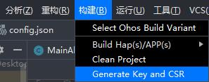
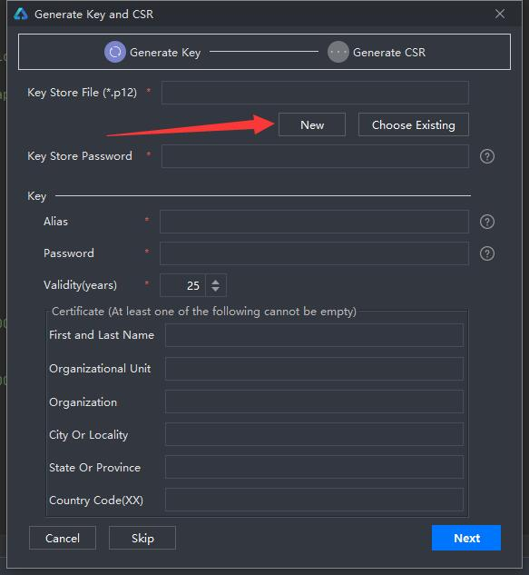
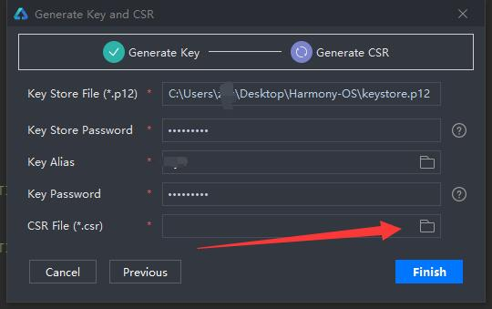
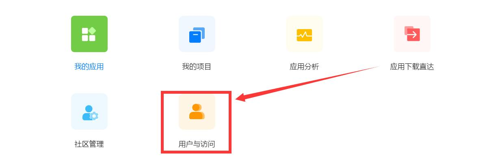
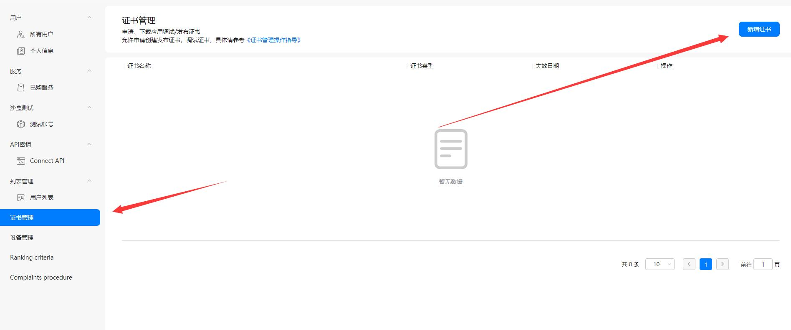
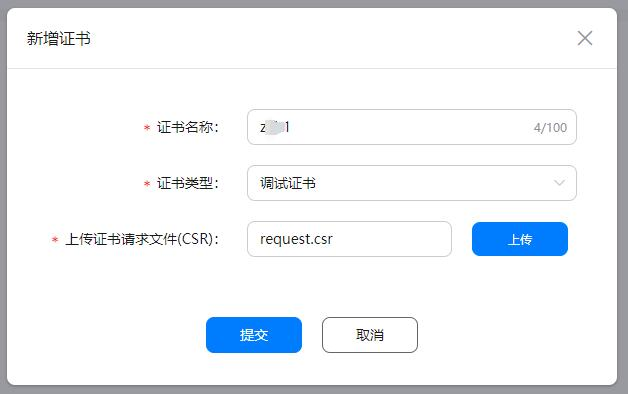
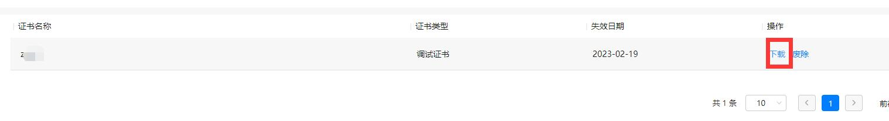
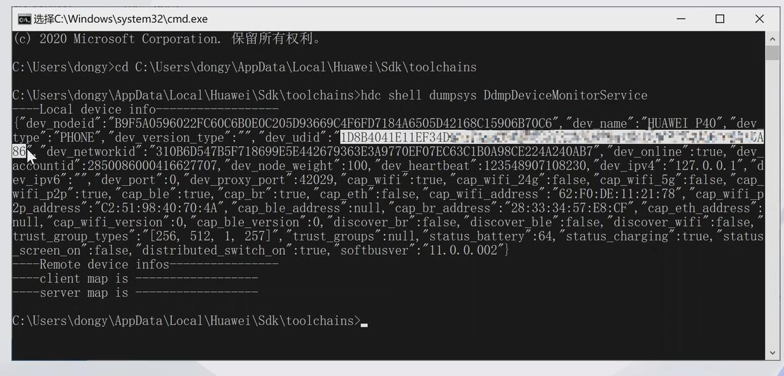
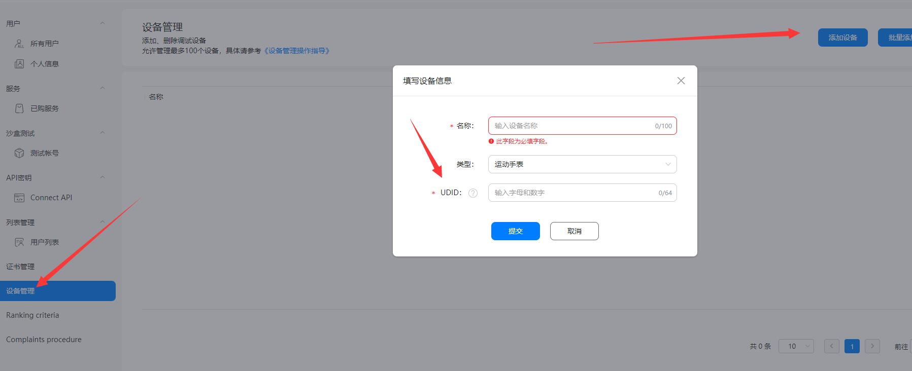

# 一、IDE配置
## 1.1.构建/Generate Key and CSR


## 1.2.生成密钥



## 1.3.其他信息

## 1.4.创建密钥库，保存位置


# 二、AppGallery Connect网站
+ https://developer.huawei.com/consumer/cn/service/josp/agc/index.html#/

## 2.1.用户与访问

## 2.2.证书管理




# 三、真机调试
### 3.1.寻找UDID
C:\Users\xxxxx\AppData\Local\Huawei\Sdk\toolchains
```js
// cmd
hdc shell dumpsys DdmpDeviceMonitorService
// usb插上真机即可 
```


### 3.2.配置


### 3.3.添加项目，应用


### 3.4.HAP管理

下载


# 四、签名
### 4.1.打开结果配置


# 五、HiLog应用程序调试--修改src/main/java/.../MainAbility
```java
 private static final HiLogLabel label = new HiLogLabel(HiLog.LOG_APP, 0x00201, "MY_TAG");
 @Override
 public void onStart(Intent intent) {
   ...
   HiLog.info(label,"输出：%{public}d", 100);
 }
```


